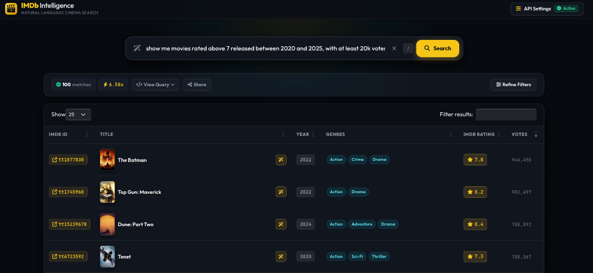

# IMDb Intelligence
**Talk to cinema history in plain English.**

Finding great movies shouldn't mean wrestling with complex filters or ten-tab IMDb searches.

**IMDb Intelligence** turns natural language questions into direct answers from a massive cinema catalog. Enriched with TMDb metadata, it connects cast and crew filmographies, ratings, original languages, country of origin, plot summaries, and posters across **1.35 million movies and feature films**, giving you instant answers, transparent query visibility, and interactive visual charts without the clutter.

**Live app:** [imdb-intelligence-app.azurewebsites.net](https://imdb-intelligence-app.azurewebsites.net/)

---

## Preview


*Query: "show me movies rated above 7 released between 2020 and 2025, with at least 20k votes" — showing generated SQL, execution metrics, TMDb posters, and ratings.*

---

## What you can do
- **Search in plain English**: Ask for movies by actor, director, genre, release decade, country, and rating thresholds.
- **Analyze trends and film counts**: Ask quantitative and aggregation questions (e.g. *"how many movies did Brahmanandam act in for each year between 2020 and 2025"*, *"how many films has Christopher Nolan directed?"*).
- **Interactive trend charts & drill-down**: View annual filmography trends in visual bar charts and click any bar to immediately inspect the underlying movie titles.
- **Filter by original language and country**: Discover genuine world cinema (e.g. Japanese anime, Spanish thrillers, Korean cinema, Telugu films) without dubbed Hollywood releases cluttering results.
- **See the SQL query**: Inspect the exact SQL query generated for each question, along with execution latency and row counts.
- **Browse posters and plot summaries**: View TMDb poster artwork and story overviews directly in the results table.
- **Get title summaries**: Generate an on-demand, spoiler-free plot overview and background trivia for any movie.
- **Refine results**: Use interactive sliders and badges to filter results dynamically by release year, rating, or genre.
- **Bring your own key (BYOK)**: Enter any OpenAI-compatible API key and endpoint in the UI settings; keys stay in your browser's local storage and are never persisted on the server.

---

## The dataset
The database combines official IMDb dumps with TMDb's open movie catalog, pruned of individual TV episodes and clutter to keep searches sub-second:

- **1.35M movies**: Feature films and cinema releases enriched with TMDb original language codes, origin countries, overviews, and poster paths.
- **1.71M ratings**: Official IMDb aggregate ratings and vote counts.
- **15.6M people**: Actors, directors, writers, and crew members.
- **13.2M credits**: Cast and crew title associations (`crew_lookup`).
- **7.75M localized titles**: Regional release names and alternative titles.

---

## How it works
- **Natural Language to SQL**: User queries are translated into standard ANSI SQL using any OpenAI-compatible language model.
- **IMDb + TMDb Enrichment**: IMDb's raw dumps lack clean original language and country tags. Joining with TMDb provides accurate `original_language` and `origin_country` metadata, ensuring language searches match original productions rather than localized dubs.
- **DuckDB Engine**: Data is stored in an indexed, read-only DuckDB database file (~2.38 GB). The backend runs analytical queries locally in memory, keeping response times under a few hundred milliseconds without requiring an external database server.
- **Cloud Sync**: The web app checks Azure Blob Storage on startup and syncs the DuckDB artifact only when the remote version changes.

---

## Example queries
- *"How many movies did Brahmanandam act in for each year between 2020 and 2025"* (Temporal trend + visual chart)
- *"How many movies has Christopher Nolan directed?"* (Scalar KPI aggregate)
- *"Which genres has Quentin Tarantino directed the most?"* (Categorical frequency breakdown)
- *"Show me movies rated above 7 released between 2020 and 2025, with at least 20k votes"*
- *"Highest rated sci-fi movies from 2010s with over 100k votes"*
- *"Movies where Leonardo DiCaprio and Kate Winslet worked together"*
- *"Best Korean thriller movies released after 2015"*
- *"Top rated animated movies directed by Hayao Miyazaki"*
- *"Highest rated movies from India released after 2000 with at least 30k votes"*
- *"Spanish horror movies with rating above 7.5"*

---

## Tech Stack

| Layer | Stack |
| :--- | :--- |
| **Frontend** | HTML5, Bootstrap 5, Vanilla JavaScript, DataTables, Chart.js 4.4 |
| **Backend** | Python 3.11+, Flask, Gunicorn, Server-Sent Events |
| **Database** | DuckDB, Parquet |
| **AI / Translation** | Any OpenAI-compatible endpoint (Azure OpenAI, OpenAI, Ollama, vLLM, OpenRouter, etc.) |
| **Hosting & Storage** | Azure App Service (Linux), Azure Blob Storage |
| **Data Sources** | IMDb Datasets, TMDb Open Movies Dataset |

---

## Running locally

### Prerequisites
- Python 3.10+
- An API key for any OpenAI-compatible endpoint (OpenAI, Azure OpenAI, Ollama, etc.)

### Setup
```bash
git clone https://github.com/sarathavasarala/natural-language-imdb.git
cd natural-language-imdb

python3 -m venv .venv
source .venv/bin/activate
pip install -r requirements.txt

python run.py
```

Open `http://localhost:5001` in your browser and click **API Settings** to add your API endpoint and key.

---

## Evaluation Benchmark Suite

The repository includes a comprehensive evaluation suite with 47 curated benchmark queries spanning 7 categories. It measures execution accuracy, schema invariants, query latency, and result fidelity (Soft-F1):

### Benchmark Categories

- **Plain & Easy**: Conversational multi-predicate queries filtering by release era, genres, rating thresholds, and vote minimums.
- **Disambiguation & Homonyms**: Resolving name collisions between different individuals and handling multi-role figures (e.g. actors who direct).
- **Regional & World Cinema**: Searching authentic foreign cinema via TMDb original language and country metadata rather than localized dubs.
- **Multi-Hop Relational Joins**: Intersecting multiple cast and crew relationships (e.g. shared credits between actors and directors).
- **Typos & Semantic Reflection**: Tolerating misspellings and fuzzy celebrity names using pre-execution entity probing and dynamic repair.
- **Security & Plan Invariants**: Validating AST read-only compliance, blocking SQL injection attempts, and bounding execution limits.
- **Aggregations & Analytics**: Generating temporal trends, yearly counts, and quantitative breakdowns that power interactive visual charts.

### Running the Evaluations

```bash
# Run full benchmark against DuckDB baseline (Offline, 0 tokens)
python -m evals.run --mode gold

# Run specific category
python -m evals.run --category aggregations_and_analytics
python -m evals.run --category disambiguation
python -m evals.run --category regional_cinema

# Run via standard unittest / pytest
python -m unittest discover -s evals -p "test_*.py"

# Run live against OpenAI-compatible endpoint
python -m evals.run --mode live
```
